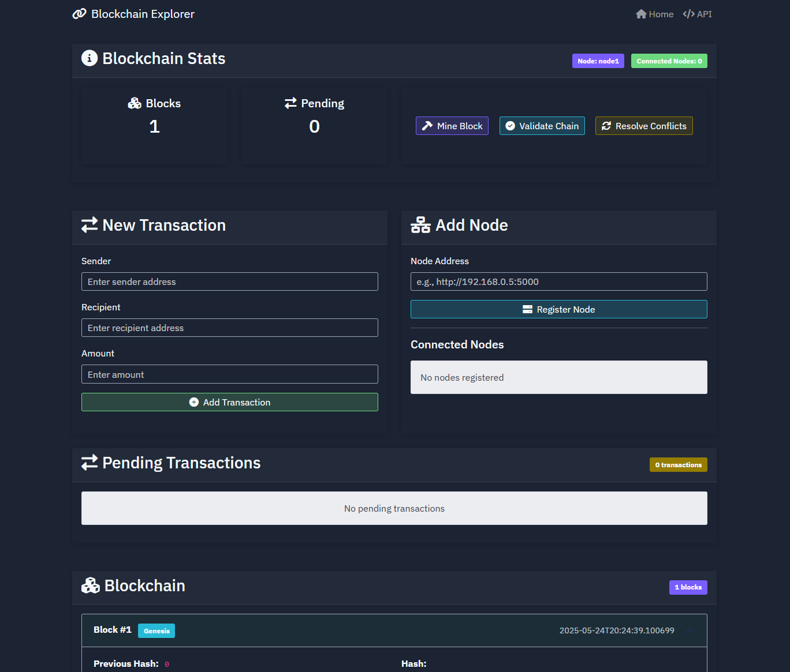

# 🔗 BlockchainBuilder

An educational and interactive **Blockchain Explorer** built with **Python, Flask**, and a modern frontend UI. Easily mine new blocks, add transactions, connect nodes, and explore your blockchain — all in one place.



---

## 🚀 Features

* 📦 **Block Explorer UI**
  Intuitive interface to view the blockchain, pending transactions, and connected nodes.

* 🔨 **Mine Blocks**
  Instantly create new blocks by mining transactions.

* ♻️ **Consensus System (basic)**
  Validate and resolve conflicts across nodes using a naive consensus algorithm.

* 🔗 **Node Networking**
  Register other nodes and sync data between them.

* 🯞 **Transaction System**
  Create and submit transactions through a simple form.

---

## 📂 Project Structure

```
.
├── static/                 # CSS and JS assets
├── templates/              # HTML templates (Jinja2)
├── app.py                  # Main Flask app
├── main.py                 # Entry point
├── blockchain.py           # Blockchain logic
├── pyproject.toml          # Project dependencies
└── README.md               # This file
```

---

## 🧪 How to Use

### 1. 🚧 Requirements

* Python 3.8+
* Flask
* Gunicorn (for production)

Install dependencies:

```bash
pip install -r requirements.txt
```

---

### 2. 🧬 Run the Project

```bash
python main.py
```

Access the UI at:
**[http://localhost:5000](http://localhost:5000)**

---

### 3. 🧪 Test the Blockchain

* Add a transaction.
* Click **Mine Block** to add it to the chain.
* Register additional nodes to test networking.
* Use **Validate Chain** or **Resolve Conflicts** to simulate consensus.

---

## 📸 Screenshots

| Explorer View                                | Add Node                             |
| -------------------------------------------- | ------------------------------------ |
|  |  |

---

## 🛠 Future Improvements

* Integrate persistent database storage
* Add digital signature verification for transactions
* Develop a more robust consensus mechanism
* Implement full REST API support (GET/POST endpoints for external interaction)

---

## 🤝 Contributing

Contributions are welcome! Feel free to fork, improve and submit a pull request.

---

## 👨‍💻 Development

This project was created by **Swytchz** and **Shox** for **Wisefy Solutions**.

---

## 📄 License

This project is licensed under the **MIT License**.
See the [LICENSE](./LICENSE) file for details.
